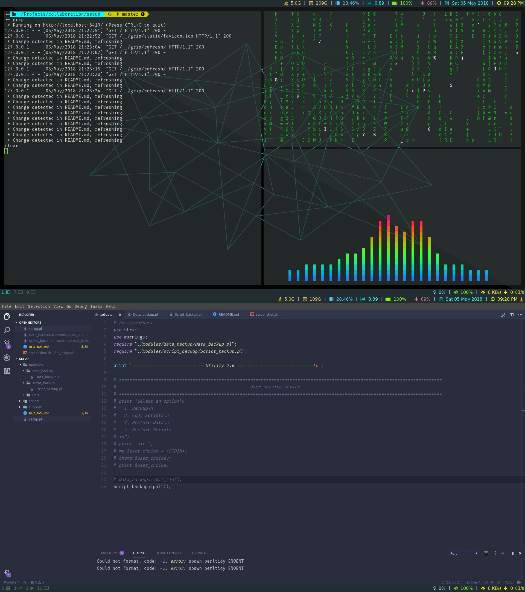

# setup
A quick tool kit for script backup, data zipping and up zipping and system state restoration  
  


## What this repo constains
A set of perl scripts that can be ready downloaded and used to backup system data, dot files. It also packs scripts and instrucations to restore all data, configurations and installed apps either automatically or manually ( if automatic method fails ).

## Installing programs

### Basic utils  
```shell
sudo apt-get rofi
sudo apt-get install thunar
sudo apt-get install git
sudo apt-get install wget
sudo apt-get winff
sudo apt-get install aria2
sudo apt-get install lxappearance
sudo apt-get install feh
sudo apt-get install blueman
```

### Adding git credentials
```shell
git config --global user.name "AakashMallik"
git config --global user.email "aakashs.mallik.cse15@itbhu.ac.in"
```

### Copy fonts and rebuild cache
```shell
sudo fc-cache -f -v ~/.fonts
```

### Installing zsh and make it default ( Requires re-login )
```shell
sudo apt-get install zsh
chsh -s $(which zsh)
```

### Install and setup powertop
```shell
sudo apt-get install powertop
sudo powertop --auto-tune
cat << EOF | sudo tee /etc/systemd/system/powertop.service
[Unit]
Description=PowerTOP auto tune

[Service]
Type=idle
Environment="TERM=dumb"
ExecStart=/usr/sbin/powertop --auto-tune

[Install]
WantedBy=multi-user.target
EOF
systemctl daemon-reload
systemctl enable powertop.service
```

### Install compton compositor
```shell
sudo apt-add-repository ppa:richardgv/compton
sudo apt-get update
sudo apt-get install compton
```

### Install oh-my-zsh ( run from ~ )
```shell
git clone https://github.com/robbyrussell/oh-my-zsh.git ~/.oh-my-zsh
```

### Install powerlevel9k ( run from ~ )
```shell
git clone https://github.com/bhilburn/powerlevel9k.git ~/.oh-my-zsh/custom/themes/powerlevel9k
```

### Install python 2.7
```shell
sudo apt install python2.7 python-pip
```

### Install i3-gaps & i3blocks
```shell
sudo apt-get intall libxcb1-dev libxcb-keysyms1-dev libpango1.0-dev libxcb-util0-dev libxcb-icccm4-dev libyajl-dev libstartup-notification0-dev libxcb-randr0-dev libev-dev libxcb-cursor-dev libxcb-xinerama0-dev libxcb-xkb-dev libxkbcommon-dev libxkbcommon-x11-dev autoconf libxcb-xrm0 libxcb-xrm-dev automake
git clone https://www.github.com/Airblader/i3 i3-gaps
cd i3-gaps
autoreconf --force --install
rm -rf build/
mkdir -p build && cd build/
../configure --prefix=/usr --sysconfdir=/etc --disable-sanitizers
make
sudo make install

sudo apt-get install i3blocks
```

